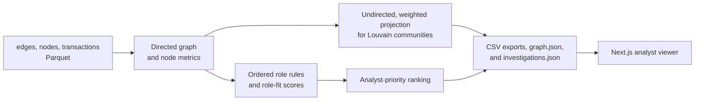

# Money Graph

Money Graph helps a bank AML analyst examine an anonymized transfer network and decide which accounts to review first. Starting from 81 known seed accounts, it assigns a rule-based role and analyst priority to every observed account, groups accounts into communities, and provides a directed network viewer. These are **leads for human review**, not findings of guilt.

This is the HackAlem AI **Analytics and Decision-Making / Cybersecurity and Compliance** case. The supplied July 2026 dataset has 2,248 accounts, 3,119 directed payer-to-recipient edges, and 4,840 transactions totaling 365,890,012 KZT.

## What is implemented

- A local Python batch pipeline that reads the three supplied Parquet files and produces `nodes_roles.csv`, `clusters.csv`, `top_nodes.csv`, the viewer's `graph.json`, and `investigations.json` in one run.
- One deterministic primary role per account, with numeric evidence, a role-fit score, and a separate analyst-priority score.
- A ranked top-20 export whose `why` field explains the score using the observed amount, counterparties, hop depth, amount-weighted PageRank, and role multiplier; the viewer shows that explanation beside the selected account.
- Louvain communities, with account count, seed count, internal observed turnover, leading gids, and a rule-based cluster hypothesis.
- A Next.js viewer with a directed transfer map, gid search, role and cluster filters, a priority-sorted review queue, and account details showing evidence and observed flows.
- A two-day matched-outflow measure from transaction dates. It supports interpretation of transit activity; it is **not** a role-assignment rule or proof that the same money moved onward.
- Selected-account investigation in the RU/EN viewer: directed seed routes of up to four edges, timing filters, route highlighting, dated transaction witnesses, all transfers on each link, and specific next-data requests. Closing account details keeps the map selection and active route. See the [investigation schema and walkthrough](docs/investigations.md).

## How it works



The analyst runs the pipeline, opens the viewer, checks the highest-priority accounts or searches for a supplied gid, then inspects the selected account's role evidence and the direction and amount of its observed links. The map and investigation routes use the **directed** graph. Only community detection and map positioning use an undirected projection; reciprocal transfer amounts are added for clustering.

## Install and run

Run these commands from the **repository root** in a Unix shell. Use Python 3.13 (the version in `.python-version`; the pinned requirements also declare support for Python 3.11–3.13). The analysis itself needs no cloud service, GPU, or API key.

```bash
python3 -m venv .venv
source .venv/bin/activate
python -m pip install -r starter/requirements.txt
python pipeline/run.py --data data --out out
```

The final command is the complete recalculation from raw Parquet to the required three CSVs, plus `graph.json` and `investigations.json`. It is intended to complete within the case's five-minute limit on the supplied dataset. `out/` is generated locally and ignored by Git.

To run the viewer locally, install Node.js 22.13 or newer. The project pins pnpm 11.7.0 in `frontend/package.json`; that pnpm release requires Node.js 22.13 or newer. Install pnpm if it is not already available:

```bash
npm install --global pnpm@11.7.0
```

Then run:

```bash
cd frontend
pnpm install --frozen-lockfile
pnpm dev
```

Open [http://localhost:3000](http://localhost:3000). A production build can be checked with `pnpm lint && pnpm build` from `frontend/`.

The viewer first tries the complete output set in `../out/`, including `graph.json`. If any required file is absent there, it uses the committed `frontend/data/` snapshot. The viewer labels its active source and warns when local output files are incomplete. Run the pipeline before starting the viewer when you want to inspect a fresh calculation. The deployment uses the committed snapshot; changes to `out/` alone do not update it.

Investigation evidence is loaded from that same directory only after schema, string-ID/reference, and companion-file SHA-256 checks. Missing or incompatible evidence leaves account analysis usable with an availability message. Refresh the bundled five-file snapshot with `python pipeline/run.py --data data --out frontend/data` from the root before publishing updated analysis.

## Reproducible judge walkthrough

1. Run the installation and pipeline commands above. Check that `out/` contains `nodes_roles.csv`, `clusters.csv`, `top_nodes.csv`, `graph.json`, and `investigations.json`.
   For a quick schema check from the repository root:

   ```bash
   python - <<'PY'
   import csv
   import json
   from pathlib import Path

   output = Path("out")
   def rows(name):
       with (output / name).open(newline="") as file:
           return list(csv.DictReader(file))

   nodes, clusters, top = (rows(name) for name in
       ("nodes_roles.csv", "clusters.csv", "top_nodes.csv"))
   required = {"gid", "role", "role_score", "cluster_id", "priority_score", "evidence"}
   assert len(nodes) == 2248 and len({row["gid"] for row in nodes}) == 2248
   assert all(required <= row.keys() and all(row[key] for key in required) for row in nodes)
   assert all(0 <= float(row["role_score"]) <= 1 and
              0 <= float(row["priority_score"]) <= 1 for row in nodes)
   assert len(top) >= 20 and all(row["why"] for row in top)
   assert {row["cluster_id"] for row in nodes} <= {row["cluster_id"] for row in clusters}
   graph = json.loads((output / "graph.json").read_text())
   assert all(isinstance(node["gid"], str) for node in graph["nodes"])
   print(f"OK: {len(nodes)} nodes, {len(clusters)} clusters, {len(top)} top nodes")
   PY
   ```
2. Inspect `out/top_nodes.csv`, then start the viewer. The review queue is sorted by `priority_score`; the first account in the committed dataset is gid `100000003684369100`, a **coordinator**. Search for that gid to center it on the map, show its incoming and outgoing links, and open its detail panel. Its recorded directed betweenness is `0.002343`, above the coordinator threshold of `0.002`.
3. Search for gid `100000004015047100`, a **consolidator**: 9 observed payers, 1 observed recipient, and 919,104 KZT observed inbound. Its evidence shows which thresholds it meets.
4. Search for gid `100000000018102100`, a **peripheral** account at depth 4. Its zero observed out-degree is a traversal cutoff, so it is not labeled a terminal recipient.
5. To inspect an arbitrary gid named by the jury, search its full identifier in the viewer. The detail panel shows its evidence and metrics; the map shows incoming and outgoing counterparties. The same gid can be located in `out/nodes_roles.csv` for the underlying metrics.
6. Select a top-20 account and read its exported ranking explanation under **Why review** (switch to EN if needed). For gid `100000000343175100`, filter **Routes from seed accounts** to **Date-ordered** and select the route through `100000005339662100`. Inspect the July 16 transfer of 26,925 KZT and July 17 transfer of 28,100 KZT, then expand **All transfers on this link**. These dates support timing compatibility, not an amount match. Close and reopen account details: the selected account and route remain highlighted. Review **What data to request next**; requests are suggestions, not automatically sent.

The example gids and figures above are from the supplied dataset. Recalculation uses the same Parquet files and rules. All gids are int64 values greater than JavaScript's safe-integer limit; **treat them as strings in JSON and JavaScript** to preserve exact search and link matching.

## Role criteria and scores

Rules run in the order below; **the first matching rule wins**. `in_deg` and `out_deg` count distinct observed counterparties, `in_kzt` and `out_kzt` are observed amounts in KZT, and `pass_through = out_kzt / in_kzt` when inbound is nonzero. Betweenness uses directed, **unweighted** shortest paths. The counts describe the committed dataset.

| Order | Role | Formal rule | Accounts |
| --- | --- | --- | ---: |
| 1 | `coordinator` | Directed betweenness ≥ 0.002 | 24 |
| 2 | `consolidator` | Non-seed, not cut off at depth 4; `in_deg ≥ 3`, `in_deg ≥ 2 × out_deg`, and `in_kzt ≥ 100,000` | 75 |
| 3 | `terminal` | Non-seed at `depth < 4`; `out_deg = 0` and `in_kzt ≥ 500,000` | 34 |
| 4 | `distributor` | `out_deg ≥ 10` and `out_kzt ≥ 500,000` | 40 |
| 5 | `transit` | Non-seed with `in_deg ≥ 1`, `out_deg ≥ 1`, and `0.8 ≤ pass_through ≤ 1.2` | 66 |
| 6 | `peripheral` | None of the preceding rules; an extra `peripheral_reason` distinguishes depth-4 cutoff, isolate, single-edge leaf, and below-threshold cases | 2,009 |

`role_score` is a 0–1 **strength of fit to the assigned rule**, not a calibrated probability, suspicion score, or estimate of criminality. Peripheral accounts receive `role_score = 0` because they match no positive role rule; their numeric evidence and `peripheral_reason` still explain the classification. The label `terminal` means an **observed endpoint within this export**, not proof that funds ultimately stayed there.

`priority_score` is separate from role fit. The pipeline calculates

```text
priority = role_factor × (0.20 + 0.30 × amount + 0.20 × counterparties
                          + 0.10 × depth + 0.20 × PageRank)
```

Here `amount` and `counterparties` are log-scaled and capped at their respective 99th percentiles, `depth = 1 / (1 + hop)`, and amount-weighted PageRank is scaled to its 99th percentile. For seeds, `amount` uses observed **outflow** and `counterparties` uses observed recipients, because their inbound side is incomplete. For other accounts, `amount` uses the larger of inbound and outbound KZT, and `counterparties` counts distinct inbound/outbound neighbors. The role factors are coordinator/consolidator `1.00`, distributor `0.95`, terminal `0.85`, transit `0.75`, and peripheral `0.10`. The result is clipped to 0–1 and sorted descending, with gid breaking ties. PageRank contributes to priority; betweenness determines the coordinator role but does not contribute again to priority.

## Outputs and architecture

| File | Required columns | What it contains |
| --- | --- | --- |
| `out/nodes_roles.csv` | `gid, role, role_score, cluster_id, priority_score, evidence` | Exactly one row per input node (2,248 for the supplied data), plus observed metrics and data-quality flags. `evidence` contains numeric rule support. |
| `out/clusters.csv` | `cluster_id, n_nodes, n_seed, sum_kzt_internal, top_gids, hypothesis` | One row per Louvain community. `sum_kzt_internal` sums original directed edges whose endpoints are both in that community; `top_gids` is a JSON list of identifier strings. |
| `out/top_nodes.csv` | `rank, gid, role, priority_score, why` | The 20 highest-priority accounts. Each `why` explains its rank and score with the observed amount, counterparties, hop depth, amount-weighted PageRank, and the contributions from the priority formula above. |
| `out/graph.json` | `meta, nodes, edges` | Viewer data with string gids, directed links, roles, clusters, priority, and precomputed map positions. |
| `out/investigations.json` | `meta, transactions, edge_transactions, accounts` | All accounts keyed by string gid; seed routes, timing classifications, transaction references, and next-data requests. The viewer validates the version and companion-file hashes before exposing evidence. |

`data/` contains the supplied, anonymized Parquet inputs. `starter/` is organizer-provided loading and base-metric code; `pipeline/run.py` adds role rules, ranking, temporal support, clustering, and exports. `frontend/lib/money-data.ts` loads and parses the outputs on the server, and `frontend/app/` renders the interactive viewer. `frontend/data/` holds the committed viewer snapshot. No AI model, LLM, external customer-enrichment source, third-party data API, or paid service is used by the analysis. Vercel hosts the supplied deployment of the viewer.

## Data limits and interpretation

- The export covers July 2026 intra-bank transfers of at least 5,000 KZT. Smaller transfers, transfers at other banks, and activity outside the month are invisible.
- Traversal starts at the 81 seeds and stops after four outgoing hops. All 444 depth-4 nodes have no observed onward edges because of that cutoff; the role rules do **not** treat this alone as evidence that money stopped there.
- Seed inbound amounts may be understated because transfers into seeds from outside the sampled graph are missing. The pipeline does not use inbound or pass-through to assign seed-specific inbound roles.
- Nineteen seeds have no observed edge. They remain in `nodes_roles.csv` and the map. The graph has disconnected parts; Louvain communities are analysis groups, not confirmed organizations.
- The supplied dataset uses synthetic gids and is provided for hackathon use. There are no names, balances, customer attributes, labels for true roles, or ground-truth accuracy measure. All roles, priorities, and cluster descriptions are explainable hypotheses for analyst verification. The two-day timing measure cannot trace identical funds through an account.
- The viewer reads files on disk; it does not offer an upload workflow or live transaction feed.
- Investigation paths describe observed connections, not traced funds. Date-ordered witnesses require 1–2 days between successive transfers; same-day sequences have unknown order. No amount matching or recurring-pattern detection is performed. Empty route lists mean no seed route was found within four edges. Route enumeration can grow rapidly on denser graphs and would need bounded retrieval at larger scale.

## Scaling beyond the hackathon dataset

The current implementation uses in-memory pandas and NetworkX, including full betweenness and spring layout. For a graph of roughly one million nodes, this approach would need chunked or columnar input processing, a graph engine or distributed/community algorithm suited to the larger graph, approximate or sampled betweenness, and persisted precomputed metrics. The viewer would need server-side search, filtering, and subgraph requests instead of sending the entire network to one browser canvas. These are design considerations, **not features of the current version**.

## Deployment

Viewer URL provided for this project: [https://hackalemai.vercel.app/](https://hackalemai.vercel.app/). The local pipeline and viewer can be run without this deployment.
